# rlmflow

<p align="center">
  <a href="https://pypi.org/project/rlmflow/"></a>
  <a href="https://github.com/shyamsn97/rlmflow/pkgs/container/rlmflow"></a>
</p>

**rlmflow is a graph-native runtime for multi-agent systems.** Instead of treating execution as a fixed sequence of agent calls, rlmflow represents agents, messages, and results as an evolving graph that drives execution. This makes it possible to inspect and modify the system as it runs, or branch execution from any point in its history.

<table>
<tr>
<td width="50%" valign="top">
<a href="examples/needle/">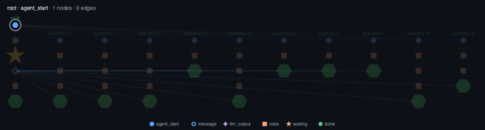</a>
<br /><b>Fan-out.</b> One agent splits an input into chunks, launches one agent per chunk, and waits for every result.
<br /><a href="examples/needle/"><code>examples/needle/</code></a>
</td>
<td width="50%" valign="top">
<a href="examples/architectures/tree.py">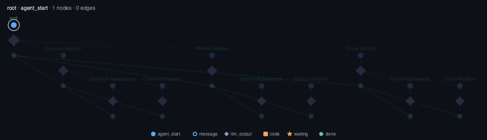</a>
<br /><b>Recursive tree.</b> A worker launches workers of its own, and each of those can do the same, until the depth limit.
<br /><a href="examples/architectures/tree.py"><code>examples/architectures/tree.py</code></a>
</td>
</tr>
<tr>
<td width="50%" valign="top">
<a href="examples/architectures/pipeline.py">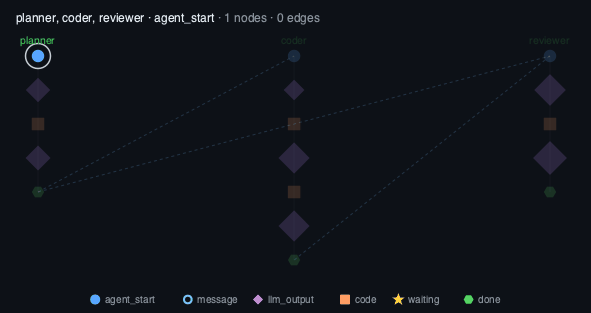</a>
<br /><b>Pipeline.</b> Each stage is launched with the results of the stages before it as variables.
<br /><a href="examples/architectures/pipeline.py"><code>examples/architectures/pipeline.py</code></a>
</td>
<td width="50%" valign="top">
<a href="examples/coding/boids/">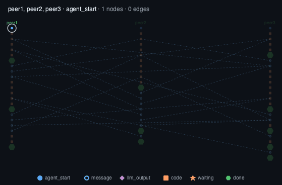</a>
<br /><b>Peers.</b> Top-level agents with no manager coordinate by messaging each other.
<br /><a href="examples/coding/boids/"><code>examples/coding/boids/</code></a>
</td>
</tr>
<tr>
<td width="50%" valign="top">
<a href="examples/architectures/review.py">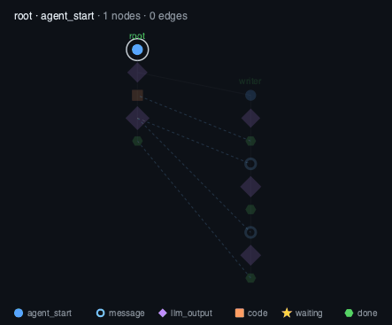</a>
<br /><b>Review loop.</b> A message reopens a finished agent, and its next result is the reply.
<br /><a href="examples/architectures/review.py"><code>examples/architectures/review.py</code></a>
</td>
<td width="50%" valign="top">
<a href="examples/shepherd/">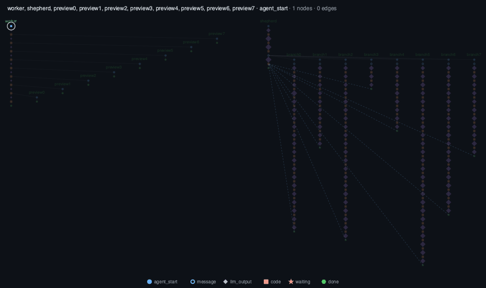</a>
<br /><b>Rewind and fork.</b> Branch any agent from any earlier step; its REPL is rebuilt and the original is untouched.
<br /><a href="examples/shepherd/"><code>examples/shepherd/</code></a>
</td>
</tr>
</table>

Every shape is a real run; [`examples/architectures/`](examples/architectures/) lists how to reproduce each one.

Read the blog post: [rlmflow](https://shyamsn97.github.io/blog/rlmflow/).

## Install

```bash
pip install "rlmflow[openai]"      # with OpenAI models
pip install "rlmflow[anthropic]"   # with Anthropic models
pip install "rlmflow[claude]"      # with Claude Code as a harness
pip install "rlmflow[all]"         # everything, including the viewer and image export
```

Set `OPENAI_API_KEY` or `ANTHROPIC_API_KEY` for the models you use. Claude Code agents use your Claude Code login; pi agents need [pi](https://github.com/badlogic/pi-mono) installed.

> **`LocalRuntime` is not a sandbox.** Agent code runs as ordinary Python with your filesystem, network and credentials. Use it only for code you would run yourself; for anything else use [`DockerRuntime` or `ModalRuntime`](docs/runtimes.md). See [Security](docs/security.md).

## Harnesses

A harness is what drives an agent: it takes the agent's next turn and lands the result in the graph. Every agent has one, picked by its config, and one run can mix them. A Claude Code root can launch REPL workers, and a REPL root can launch Claude Code workers.

| Harness | What drives the agent | How to start it | Needs |
| --- | --- | --- | --- |
| `repl` (default) | rlmflow calls the model, and the model writes ```` ```repl ```` blocks that run in the agent's Python REPL | `AgentConfig(model="gpt-5")` | an OpenAI or Anthropic key |
| `claude_code` | A headless Claude Code session per agent, with your Claude Code settings, tools and `CLAUDE.md` | `AgentConfig(harness="claude_code")` | `rlmflow[claude]`, signed in to `claude` |
| `pi` | A headless [pi](https://github.com/badlogic/pi-mono) session per agent | `AgentConfig(harness="pi")` | `pi` installed |
| Your Claude Code session | You, in your own terminal: your session becomes the root agent | `/rlmflow:run TASK` in Claude Code | the `claude` CLI |
| Your own | Anything that can take a turn: Codex, another CLI, a human, a script | `AgentConfig(harness=MyHarness)` | a `Harness` subclass |

Every harness reaches the same agent tools (`launch_agent`, `AGENTS`, `agent.send`, `submit`) in the same per-agent REPL, so every launch, message and result lands in one graph, whatever drove it.

### Your Claude Code session as the root agent

Load the plugin and start a run with a task:

```text
$ cd my-project
$ claude --plugin-dir "$(rlmflow plugin path)"
> /rlmflow:run There are 100 text files in haystack/. Exactly one line in one file matches the pattern
  `The magic number is <number>`. Find the number and the file it's in. Use rlmflow agents to search
  the files in parallel.
```

The plugin starts `rlmflow serve` for the project, and your session becomes the run's root agent. Here is what the session did in a real run (Nov 8 2026, Claude Code root, gpt-5-mini workers, 34 s):

1. It ran Python in its REPL through `rlmflow repl`, splitting the files and launching four workers:

   ```text
   $ rlmflow repl <<'EOF'
   files = sorted(os.listdir("haystack"))
   chunks = [files[i:i+25] for i in range(0, len(files), 25)]
   kids = [launch_agent("Search these files in haystack/ for a line matching ... Files: " + ", ".join(c),
                        config="worker") for c in chunks]
   EOF
   ```

2. It said "I've launched 4 agents, each searching 25 files. I'll wait for their results." and ended its turn. The plugin's Stop hook held the session until a worker finished and handed its result back: "Worker 1 searched files 0025–0049 and found nothing ... I'll keep waiting." That happened three times; the third result had the match.
3. It checked the match with its own `grep`, then submitted in the REPL, `submit({"number": 2536600, "file": "haystack/file_0060.txt", "line": 67})`, and replied with the answer. The last worker, still running, finished in the background.

<p align="center">
  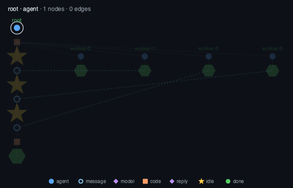
</p>

The run is saved as it goes under `.rlmflow/runs/<timestamp>/`; `rlmflow view show` on it prints the tree and timeline:

```text
└── root: done {'number': 2536600, 'file': 'haystack/file_0060.txt', 'line': 6… (4 turns)
    ├── root.worker-0: done …
    ├── root.worker-1: done …
    ├── root.worker-2: done …
    └── root.worker-3: done …

     1  +   0.00s  root · agent           start root · root · interactive
     2  +   4.38s  root · code            import os files = sorted(os.listdir("haystack")) …
     3  +   4.60s  root.worker-0 · agent  start worker-0 · worker · repl · model gpt-5-mini
     …
     7  +   6.55s  root · idle            idle, waiting for messages
     8  +  20.37s  root.worker-1 · done   done …
     9  +  20.66s  root · message         from rlmflow: Agents you started have finished. …
     …
    17  +  30.52s  root · code            submit({"number": 2536600, "file": "haystack/file_0060.txt", "line": 67})
    18  +  32.85s  root · done            done {'number': 2536600, 'file': 'haystack/file_0060.txt', 'line': 67}
```

Anything you type after the root finishes is a message to it, and reopens it. Workers use the coding Flow built from `rlmflow.toml`, or your own Flow if you set `flow = "mypkg.agents:build"` there. The plugin does nothing in sessions that didn't run `/rlmflow:run`.

### Claude Code or pi as workers

Give a config the harness, and agents launch it by name like any other:

```python
from rlmflow import AgentConfig, Flow

flow = Flow(
    configs=[
        AgentConfig(model="gpt-5"),  # root: rlmflow's REPL harness
        AgentConfig(
            name="claude",
            harness="claude_code",
            harness_options={"sdk": {"permission_mode": "acceptEdits"}},
        ),
        AgentConfig(name="pi", harness="pi"),
    ]
)

flow.run(
    "Split the TODOs in src/ by directory, and give each directory to a `claude` agent to fix."
)
```

The root's code runs `launch_agent("Fix the TODOs in `path`.", config="claude", path=d)`. Each `claude` agent is a real Claude Code session in the working directory, with its own tools, permissions and `CLAUDE.md`. It reaches its REPL and the agent tools with `rlmflow repl`, as your own session does. To wait on workers of its own, it ends its turn, and the session is resumed with their results. To run the whole thing on Claude Code, pass it as the root: `flow.run(task, root_config=AgentConfig(harness="claude_code"))`.

Code a session runs through `rlmflow repl` is recorded in the graph. Edits it makes with its own tools are not recorded as nodes, but each turn's workspace snapshot has the files.

### Your own harness

A harness takes an agent's next step and returns the node to land. rlmflow doesn't ship one for Codex yet. One would be a `SessionHarness` like [`pi.py`](rlmflow/harnesses/pi.py) (about 100 lines), which runs one CLI turn per step and parses its JSON output:

```python
from rlmflow.harnesses.sessions import Session, SessionHarness, TurnResult, next_prompt


class CodexHarness(SessionHarness):
    name = "codex"

    async def run_turn(self, flow, step, turn):
        session = Session.for_step(step)
        prompt = await next_prompt(flow, step, session)
        argv = ["codex", "exec", "--json", f"{self.prompt(flow, step)}\n\n{prompt}"]
        stdout = await self.run_command(flow, step, argv, turn.env)
        ...  # read the reply text and token usage out of codex's JSON events
        return TurnResult(session_id=session.id, text=text, usage=usage)


flow = Flow(configs=[AgentConfig(model="gpt-5"), AgentConfig(name="codex", harness=CodexHarness)])
```

See [Claude Code and pi as agents](docs/usage.md#claude-code-and-pi-as-agents), [Agents](docs/agents.md#claude-code-and-pi-sessions) and [Internals](docs/internals.md).

## Usage

Besides the harnesses above, there are three ways in: the Python library, the agent's own REPL, and the command line.

### From Python

`Flow` runs agents; `AgentConfig` describes one kind of agent. The first config is the root's; the others are kinds the root can launch.

```python
from rlmflow import FILE_TOOLS, AgentConfig, Flow, LocalRuntime

flow = Flow(
    configs=[
        AgentConfig(model="gpt-5"),
        AgentConfig(name="worker", model="gpt-5-mini"),
    ],
    tools=[FILE_TOOLS],
    runtime=LocalRuntime(working_directory="workdir"),
)

answer = flow.run("Count the TODOs in every file under src/, one worker per directory.")
```

Keyword arguments to `run` become variables in the root's REPL: `flow.run("Find the needle.", haystack=lines)`. To watch the run, steer it, or keep the graph, stream it:

```python
import asyncio
from rlmflow import Graph
from rlmflow.view.text import kind


async def main():
    g = Graph()
    root = g.start("Build a text adventure game in Python, with combat and inventory.")
    async for step in flow.run_streaming(g):
        print(step.agent.path(), kind(step.node))  # every node as it finishes
    print(root.final_result())
    g.save("workdir/graph")  # reload with Graph.load


asyncio.run(main())
```

See [Usage](docs/usage.md) for configs, models, prompts, runtimes, stopping, and saving and resuming.

### Inside an agent's REPL

The agent writes ordinary Python. These are the calls that build the graph:

| Call | What it does |
| --- | --- |
| `launch_agent(task, config="worker", **args)` | Start an agent with a fresh context; `**args` become its variables. Returns a handle at once. |
| `await agent`, `await asyncio.gather(*agents)` | Wait for the results of agents you launched. |
| `agent.send(message, **inputs)` | Message an agent, reopening it if it finished; `**inputs` become its variables. For an agent you launched, `await` it for the reply. |
| `AGENTS["name"]` | Any agent in the run, by name, path or id, with its status, result, parent and children. |
| `llm_query(prompt, schema=...)` | One model call with no conversation. |
| `submit(value)` | Finish with a result. |

```python
chunks = [haystack[i : i + 100_000] for i in range(0, len(haystack), 100_000)]
workers = [
    launch_agent("Find the magic number in `chunk`.", config="worker", chunk=c) for c in chunks
]
results = await asyncio.gather(*workers)
submit(next(r for r in results if r))
```

See [Agents](docs/agents.md).

### From the command line

`rlmflow` is also a coding agent you can run over a directory, plus tools for reading any saved run:

```bash
rlmflow run print "fix the failing test"     # a coding agent over .: stream it, print the answer
rlmflow run --model gpt-5 --workdir ./proj print "add a test for parse_args"
rlmflow run --resume ./graph print "now update the docs"

rlmflow view show runs/x                     # the agent tree, then the timeline
rlmflow fork runs/x NODE --config worker     # copy a saved run cut after a node, and run the copy
rlmflow render gif runs/x run.gif            # or html, svg, browser
```

Settings come from flags, then `RLMFLOW_*` variables, then `./rlmflow.toml`, then `~/.config/rlmflow/config.toml`. See [Command line](docs/cli.md).

## Results

Real runs of the examples below, Nov 2–4 2026. [Example results](docs/example_results.md) has the per-run tables, figures and caveats.

| Example | What it shows | Result |
| --- | --- | --- |
| [Shepherd](#shepherd-rewind-and-fork-a-failed-run) | Rewind and fork a failed run | A worker jams a Sokoban puzzle after 8 pushes; 3 of 8 forked branches solve it. Every branch that rewound 6 or more pushes solved; every branch that kept 3 or more of the jammed pushes stayed stuck. |
| [Needle](#needle-fan-out-on-any-harness) | Fan-out, with harnesses mixed per agent | 4 of 4 root × worker combinations of the REPL harness and Claude Code find the needle, with the same graph shape. |
| [Autoresearch](#autoresearch-a-planner-running-gpu-trials) | A planner running long GPU trials | Validation bits per byte 1.155 → 0.920 with REPL implementers, → 0.866 with Claude Code implementers, in 8 trials each. |
| [Boids](#boids-peers-build-an-app-with-no-manager) | Peers with no manager build an app by messaging | Claude Code peers: a working app, 21 messages in the graph. gpt-5 peers: 4 of 6 runs flock; 3 of 6 meet the whole spec. |

## Examples

### Shepherd: rewind and fork a failed run

A worker plays Sokoban and jams a box against a wall after 8 pushes. A gpt-5 shepherd reads the stuck transcript, previews the board at each rewind depth, and forks the worker at 8 different points in its run, each with its own plan. The forks run in parallel as gpt-5-mini agents, and the shepherd picks the best.

<p align="center">
  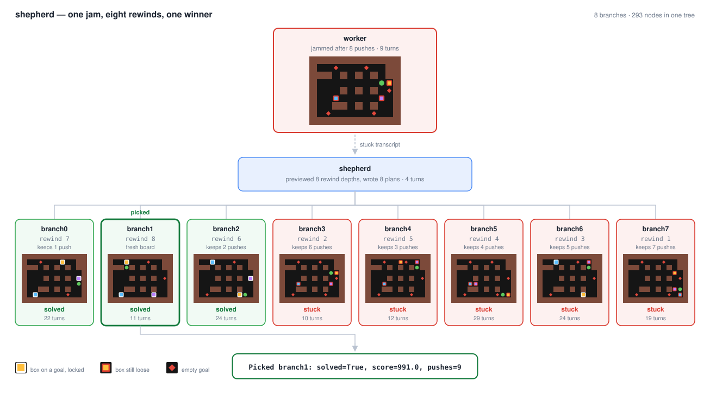
</p>

<p align="center">
  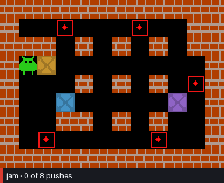
</p>

The three branches that rewound six, seven and eight pushes solved it; the picked one restarted from the fresh board and solved in 9 pushes. A retry from the jam point alone would have failed.

```bash
pip install "rlmflow[openai,image]"
python examples/shepherd/shepherd.py --trace
```

[Example](examples/shepherd/) · [Walkthrough](docs/shepherd.md)

### Needle: fan out on any harness

The root splits 100 files into batches, launches a searcher per batch, and submits the number they find. `--all` runs every combination of root harness and worker harness. The graph has the same shape whichever harness runs which agent:

<p align="center">
  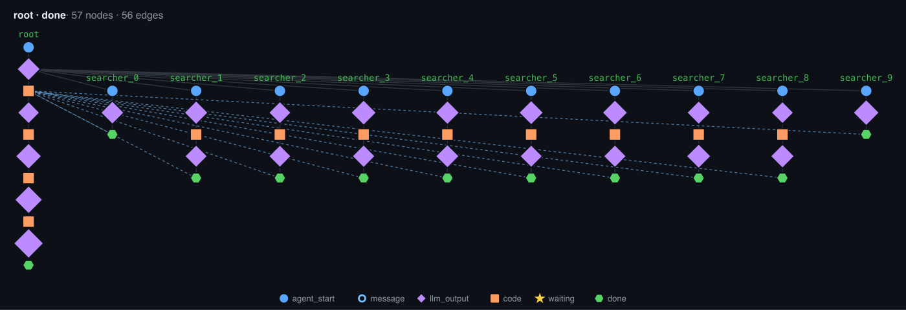
</p>

```bash
pip install "rlmflow[openai,claude]"
python examples/needle/filesystem.py --all
```

[`haystack.py`](examples/needle/haystack.py) is the same idea at scale: one million lines passed in as a Python value, split across gpt-5-nano workers.

[Example](examples/needle/)

### Autoresearch: a planner running GPU trials

A gpt-5 planner proposes changes to a small GPT trained on TinyStories. Each trial is implemented by a child agent, on the REPL harness or as a Claude Code session, and trained for 5 minutes on a Modal GPU. The planner reads the scores and plans the next trials.

<p align="center">
  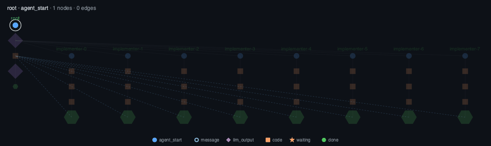
</p>

<p align="center">
  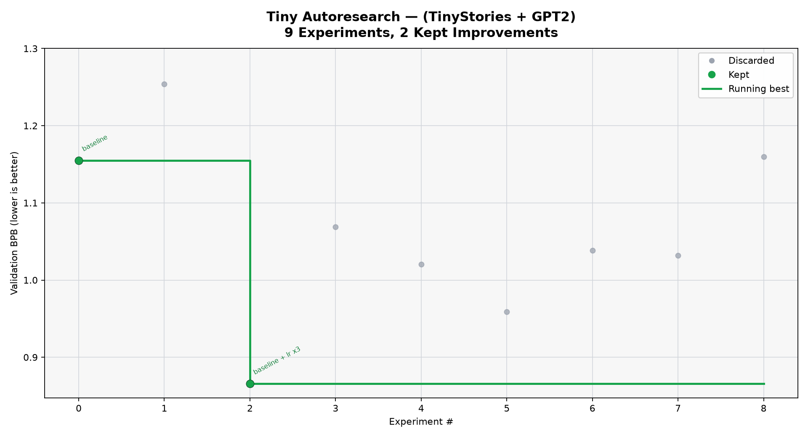
</p>

```bash
pip install "rlmflow[openai,claude,modal]"
python examples/autoresearch/run.py --max-submissions 8 --parallel 4 --implementer-harness claude_code
```

[Example](examples/autoresearch/)

### Boids: peers build an app with no manager

Three top-level agents get the same product spec for a browser boids simulation, plus one line: there are three of you and no manager, so split the work, agree on interfaces by messaging each other, and write only your own files. Their tools are generic: file tools, their REPL, and a headless browser that shows them screenshots of the page and returns its console output. Nothing grades the app for them.

<p align="center">
  
</p>

<p align="center">
  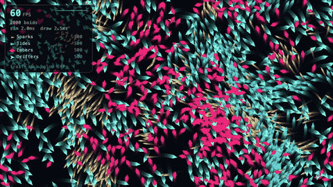
</p>

The three Claude Code peers above each proposed a split at once, converged on one written into `INTERFACE.md`, and exchanged 21 messages in 3.5 minutes. gpt-5 peers on the REPL harness negotiate too, and 4 of 6 runs flock.

```bash
pip install "rlmflow[claude,image]"
python examples/coding/boids/boids.py --harness claude_code
```

[Example](examples/coding/) · More in the [examples guide](examples/README.md)

## How the graph is built

A graph holds nodes and edges. A node is one chat message: the text the model reads, inputs that become REPL variables, and the code the REPL runs. An agent is its first node, and owns the nodes after it:

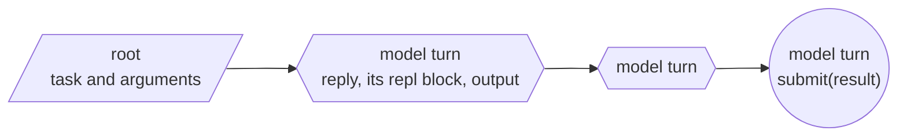
```mermaid
flowchart LR
  r[/"root<br/>task and arguments"/] --> b{{"model turn<br/>reply, its repl block, output"}} --> c{{"model turn"}} --> d(("model turn<br/>submit(result)"))
```

Each model call is one assistant node: the reply, the code from its `repl` block, and what that code printed. `submit(...)` in the code, or a reply with no `repl` block, marks that node terminal with the agent's result. Everything that arrives from outside is a user node: a batch of results, a peer's message, a controller's nudge, with any values it carries bound as variables. A Claude Code or pi session that ends its turn waiting for messages marks its last node idle. Edges are what crosses between agents: `spawn` from the node that launched an agent, `return` from a child's terminal node to wherever its result went, and `write` from the node that sent a message. Below, solid arrows join an agent's nodes and dotted arrows are edges.

**`launch_agent` + `await`.** Launching adds an agent and a `spawn` edge from the node whose code launched it. Awaiting it in the same code returns the child's result in place, and a `return` edge records that the node used it:

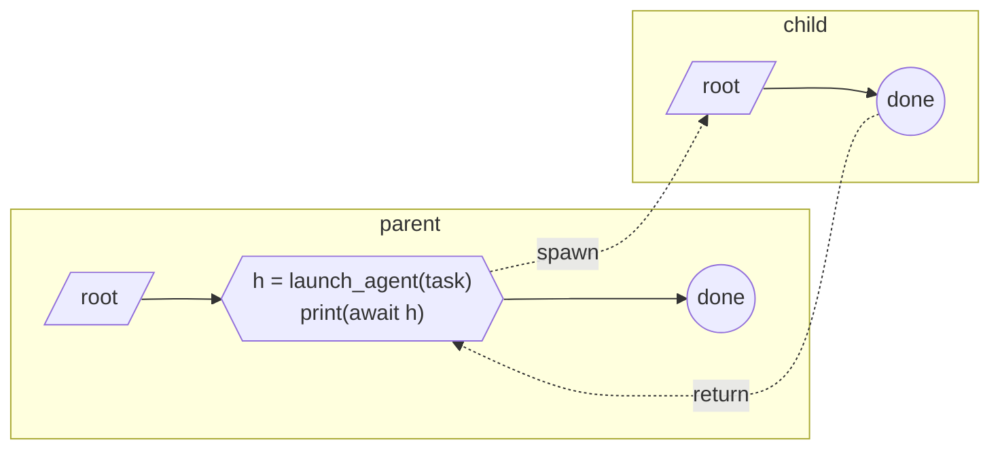
```mermaid
flowchart LR
  subgraph parent
    p0[/root/] --> p1{{"h = launch_agent(task)<br/>print(await h)"}} --> p2((done))
  end
  subgraph child
    c0[/root/] --> c1((done))
  end
  p1 -. spawn .-> c0
  c1 -. return .-> p1
```

**`launch_agent` without awaiting.** The child runs in the background. When it finishes, its result reaches the parent in a user node before the parent's next turn, bound as a variable named after the child:

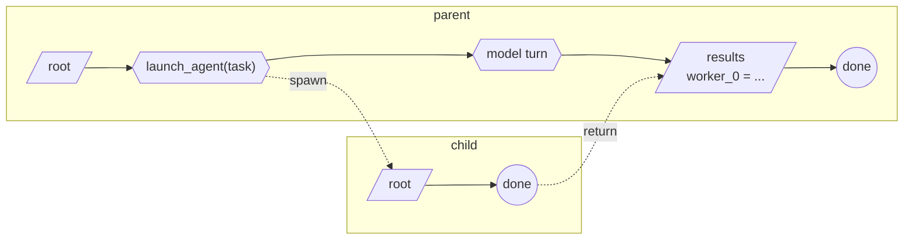
```mermaid
flowchart LR
  subgraph parent
    p0[/root/] --> p1{{"launch_agent(task)"}} --> p2{{model turn}} --> p3[/"results<br/>worker_0 = ..."/] --> p4((done))
  end
  subgraph child
    c0[/root/] --> c1((done))
  end
  p1 -. spawn .-> c0
  c1 -. return .-> p3
```

**`agent.send(message, **inputs)`.** A message is a user node added to the target, even if the target already finished: a finished agent reopens and takes another turn. You can await only agents you launched (and theirs), so `await child.send(...)` returns the child's reply, while peers answer with a message of their own:

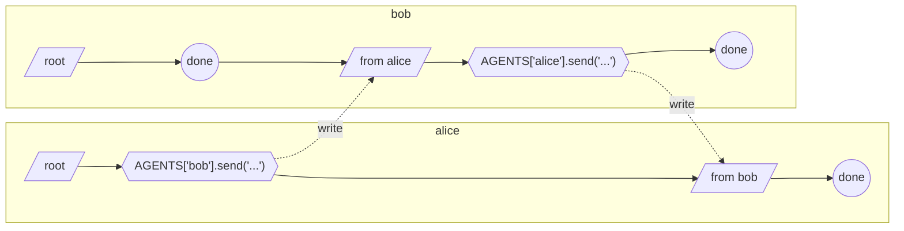
```mermaid
flowchart LR
  subgraph alice
    a0[/root/] --> a1{{"AGENTS['bob'].send('...')"}} --> a2[/"from bob"/] --> a3((done))
  end
  subgraph bob
    b0[/root/] --> b1((done)) --> b2[/"from alice"/] --> b3{{"AGENTS['alice'].send('...')"}} --> b4((done))
  end
  a1 -. write .-> b2
  b3 -. write .-> a2
```

**`g.fork(node)`.** A fork is a new graph: a copy of the run with the same ids, cut right after `node`. What came after `node` is gone, including the agents it launched, and the original is untouched. Steer the copy with a message and run it on its own; its REPLs are rebuilt by running their agents' nodes again. Shepherd forks one jammed worker at eight different points:

```python
branch = g.fork(node)
branch.send(branch.agent(node.owner), "Try a different approach.")
flow.run(branch)
```

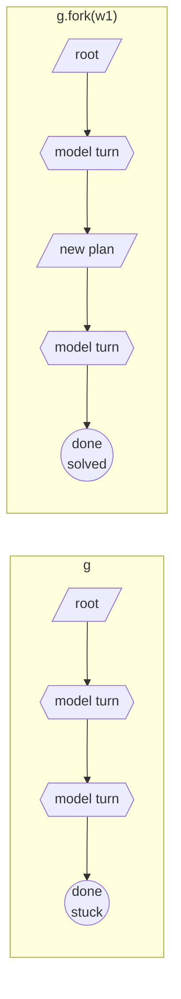
```mermaid
flowchart LR
  subgraph run["g"]
    w0[/root/] --> w1{{model turn}} --> w2{{model turn}} --> w3(("done<br/>stuck"))
  end
  subgraph copy["g.fork(w1)"]
    f0[/root/] --> f1{{model turn}} --> f2[/"new plan"/] --> f3{{model turn}} --> f4(("done<br/>solved"))
  end
```

**Editing.** The graph is plain data and fully editable, with no `Flow` running. `g.edit(node, ...)`, `g.delete(node)`, `g.remove(agent)` and `g.replace(node, i, value)` change it, and the edges say what depended on the change: the agent rewinds to the edited node, and a node whose code used an edited result reruns in place on the next `flow.run(g)`. Each returns what it invalidated, and `dry_run=True` only reports it:

```python
child = root.children()[0]
print(g.edit(child.last_turn(), result="42", dry_run=True))  # what would redo
g.edit(child.last_turn(), result="42")
flow.run(g)  # the parent's code reruns with 42
```

Host code can also `g.send(agent, text, **inputs)`, `g.fork(node)`, `g.start(...)`, `g.link("peer", a, b)`, `g.save(path)` and `Graph.load(path)`. See [Usage](docs/usage.md#change-a-run) and the [graph tour](examples/graph/).

## Tools

A tool is a Python function. Its docstring and signature describe it to the agent, and it runs in your process, so it can use your clients and connections:

```python
def lookup_customer(customer_id: str) -> dict:
    """Look up a customer by id."""
    return crm.get(customer_id)


flow = Flow(tools=[FILE_TOOLS, lookup_customer])
```

`@tool(...)` sets a name, description or visibility; `tool_from_schema` wraps a JSON Schema tool; and a toolkit brings tools that need a live connection, such as every tool on an MCP server:

```python
from rlmflow.integrations.mcp import MCPTools

flow = Flow(tools=[MCPTools("python", "weather_server.py")])
```

A tool can show the agent an image with `attach_image(path)`, which is how Boids' browser tool shows screenshots. See [Tools](docs/control.md#tools).

## See a run

Every view is a render of the graph, live or saved:

```bash
rlmflow view show runs/x                   # the agent tree and timeline
rlmflow render html runs/x run.html        # a single-file stepper
rlmflow render gif runs/x run.gif          # an animation, like the ones above
rlmflow render browser runs/x              # the browser viewer
```

See [Observability](docs/observability.md) and the [command line](docs/cli.md).

## Docs

- [Usage](docs/usage.md): running, configs, models, tools, runtimes, streaming, forking, Claude Code and pi, the CLI.
- [Agents](docs/agents.md): what an agent does in a run: its REPL tools, launching, waiting and messaging.
- [Runtimes](docs/runtimes.md) · [Security](docs/security.md) · [Observability](docs/observability.md) · [Internals](docs/internals.md)
- [Changelog](CHANGELOG.md) · [Upgrading](UPGRADING.md) · [All docs](docs/index.md)

## References

- [Recursive Language Models](https://github.com/alexzhang13/rlm): the paper and implementation that inspired this project, and [rlm-minimal](https://github.com/alexzhang13/rlm-minimal), the single file rlmflow grew from.
- [Tau](https://github.com/huggingface/tau): rlmflow's separation of execution, durable state and consumers follows its harness design.
- [Scaling Managed Agents](https://www.anthropic.com/engineering/managed-agents): separating harness, session and sandbox.
- [ypi](https://github.com/rawwerks/ypi): a recursive coding agent on pi; our session layout and parts of the default prompt come from it.
- [Shepherd](https://arxiv.org/abs/2605.10913) (Yu et al., 2026) motivates the Shepherd example.

## License

See [LICENSE](LICENSE).

## Citation

```bibtex
@misc{sudhakaran2025rlmflow,
  author = {Sudhakaran, Shyam},
  title = {rlmflow},
  year = {2025},
  publisher = {GitHub},
  journal = {GitHub repository},
  howpublished = {\url{https://github.com/shyamsn97/rlmflow}},
}
```
