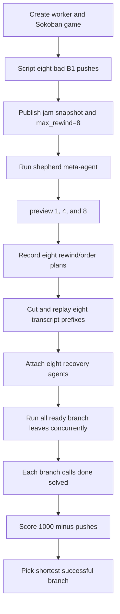

# Shepherd run: rewind, replay, fan-out, and selection

> Analysis date: 2026-08-12  
> Run inspected: `examples/_runs/shepherd`  
> Implementation: [`examples/shepherd`](../../examples/shepherd/)  
> Saved graph: `examples/_runs/shepherd/shepherd/graph.json`

## Executive summary

This run demonstrates the intended Shepherd pattern successfully at the branch
level:

1. A deliberately myopic Sokoban worker pushed one box right eight times and
   stopped in a bad position.
2. A stronger shepherd inspected three historical states: one, four, and eight
   pushes before the jam.
3. The shepherd proposed eight recovery plans with different rewind depths and
   box-to-goal orders.
4. The host forked the worker transcript at each requested point, replayed the
   retained prefix into a fresh Python worker, and ran all eight recovery agents
   concurrently.
5. **All eight recovery branches solved the board.**

The best actual trajectory was **branch1**, which solved in 13 total box pushes
and therefore earned the intended score `1000 - 13 = 987`.

The run also exposed a real lifecycle bug, since fixed (see
[below](#the-terminal-child-lifecycle-bug-fixed)). The saved shepherd result says:

```text
Picked branch0: solved=False, score=-1000.0, pushes=0
```

That result is false. Each branch's durable terminal node says `result:
"solved"`, and each final board observation says `3/3 boxes locked`. The
framework closes a terminal child REPL before the example reads its final `ENV`
or retrieves its `game` object. `Branch.env` consequently opens an empty
replacement worker and reports the defaults `solved=False`, `pushes=0`, and
`dist=0`. The same premature close prevents final trace export.

This distinction is important:

- **The recovery agents and parallel scheduler worked.**
- **The post-run scoring/export lifecycle did not.**

## What the saved run contains

There are two persisted graphs.

### The jammed worker

`examples/_runs/shepherd/worker` contains one agent and 28 nodes. It is
intentionally unfinished: its latest node is the eighth successful push, not a
`DoneOutput`.

The scripted jam starts with B1 at `(3,2)` and pushes it right once per turn until
it reaches `(3,10)`. That creates a useful recovery trajectory with eight
decision points while avoiding model variability in the setup.

The saved worker summary is therefore:

- agents: 1 (`root`)
- nodes: 28
- finished: false
- latest action: `B1 (3,9) -> (3,10)`
- rewindable successful pushes: 8

The worker graph is not the final experiment result. It is the source trajectory
from which recovery branches are cut.

### The shepherd tree

`examples/_runs/shepherd/shepherd` contains the meta-agent plus eight attached
recovery agents:

```text
root
├── branch0
├── branch1
├── branch2
├── branch3
├── branch4
├── branch5
├── branch6
└── branch7
```

Its saved summary reports:

- agents: 9
- nodes: 738
- node types: 189 LLM outputs, 189 execution actions, 179 execution
  outputs, 159 user queries, 9 agent starts, 9 done outputs, 3 error outputs,
  and 1 append-child action
- graph created: `2026-08-12T23:39:50Z`
- final root node: `2026-08-12T23:54:11Z`
- wall-clock span: about 14 minutes 21 seconds
- root marked finished: true

The root used two model turns:

1. Inspect the inputs and call `preview(1)`, `preview(4)`, and `preview(8)`.
2. Submit eight recovery plans through `branch([...])`.

The first planning request used 2,873 input and 1,330 output tokens. The second
used 3,731 input and 8,984 output tokens. The unusually large second response is
worth monitoring: plan generation alone emitted almost nine thousand tokens for
a payload that ultimately contained eight small dictionaries.

## Cost and latency profile

The saved usage metadata reports a very large total:

- input tokens: 411,843
- output tokens: 350,293
- root planner: 6,604 input / 10,314 output over 2 calls
- all recovery workers: 405,239 input / 339,979 output over 151 calls

Per-branch usage was:

- branch0: 32,638 input / 26,297 output over 12 calls
- branch1: 31,479 input / 24,017 output over 12 calls
- branch2: 42,089 input / 37,605 output over 16 calls
- branch3: 57,495 input / 50,322 output over 22 calls
- branch4: 36,479 input / 42,160 output over 14 calls
- branch5: 84,037 input / 64,943 output over 31 calls
- branch6: 56,587 input / 45,227 output over 21 calls
- branch7: 64,435 input / 49,408 output over 23 calls

The parallel append-child action remained open for about 699 seconds while it
waited for every branch. Approximate branch wall times, measured from fan-out,
were:

- branch1: 251 seconds
- branch0: 286 seconds
- branch2: 393 seconds
- branch4: 436 seconds
- branch6: 479 seconds
- branch7: 529 seconds
- branch3: 546 seconds
- branch5: 702 seconds

This is a best-of-eight search with a long tail: branch1 had already found the
best solution roughly 7.5 minutes before branch5 completed. The current
experiment intentionally waits for a complete graph, but a production optimizer
could separate “first acceptable answer,” “current best,” and “wait for every
trajectory” policies.

## The eight branch outcomes

The following values come from each branch's final board observation and durable
`DoneOutput`, not from the incorrect root summary.

### branch1 — actual winner

- rewind: 6 pushes
- requested order: B1→G1, then B3→G5
- final assignment: B1→G1, B2→G4, B3→G5
- total pushes: 13
- intended score: 987
- durable result: solved
- completed: `23:46:38Z`

### branch0

- rewind: 2 pushes
- requested order: B1→G2, then B2→G4
- final assignment: B1→G2, B2→G4, B3→G3
- total pushes: 16
- intended score: 984
- durable result: solved
- completed: `23:47:12Z`

This branch first answered `done("solved")` without a fenced REPL block. The
runtime correctly returned `MissingReplError`, and the model repaired the format
on the next turn.

### branch2

- rewind: 4 pushes
- requested order: B2→G4, then B3→G3
- final assignment: B1→G1, B2→G4, B3→G3
- total pushes: 18
- intended score: 982
- durable result: solved
- completed: `23:49:00Z`

This branch also needed one extra turn to repair a blockless `done("solved")`.

### branch4

- rewind: 3 pushes
- requested order: B1→G1, then B2→G4
- final assignment: B1→G1, B2→G4, B3→G3
- total pushes: 18
- intended score: 982
- durable result: solved
- completed: `23:49:44Z`

Branches 2 and 4 reached the same final box-to-goal assignment despite receiving
different two-step orders. The planner produced eight plans, but the run yielded
seven distinct final assignments.

### branch3

- rewind: 7 pushes
- requested order: B1→G2, then B3→G5
- final assignment: B1→G2, B2→G3, B3→G5
- total pushes: 22
- intended score: 978
- durable result: solved
- completed: `23:51:34Z`

### branch6

- rewind: 5 pushes
- requested order: B2→G1, then B3→G5
- final assignment: B1→G3, B2→G1, B3→G5
- total pushes: 22
- intended score: 978
- durable result: solved
- completed: `23:50:28Z`

This branch also repaired a blockless `done("solved")` on its next turn.

### branch7

- rewind: 1 push
- requested order: B2→G2, then B3→G3
- final assignment: B1→G1, B2→G2, B3→G3
- total pushes: 29
- intended score: 971
- durable result: solved
- completed: `23:51:18Z`

### branch5

- rewind: 8 pushes
- requested order: B3→G2, then B1→G3
- final assignment: B1→G3, B2→G5, B3→G2
- total pushes: 30
- intended score: 970
- durable result: solved
- completed: `23:54:11Z`

The deepest rewind produced the longest successful solution in this run.
Rewinding farther creates a cleaner history but discards more useful progress;
it is not automatically better.

## End-to-end control flow



The implementation divides responsibility deliberately:

- **Sokoban** owns game rules and cheap verifier signals.
- **The weak worker model** chooses one legal box push per turn.
- **The strong shepherd model** chooses rewind depth and strategic box-to-goal
  order, but not individual moves.
- **The host** performs graph surgery, deterministic replay, scheduling,
  persistence, scoring, and visualization.

This prevents the strong model from directly solving every move while still
letting it reshape a failed trajectory.

## How rewind works

Rewind is transcript-based, not a live process-memory fork.

[`recovery.py`](../../examples/shepherd/recovery.py) finds successful push turns
by scanning the worker transcript:

1. Select `LLMOutput` nodes whose code contains `push(...)`.
2. Keep only turns whose resulting output contains a successful `pushed ...`
   line.
3. Interpret `rewind=k` as the kth successful push from the end.
4. Cut immediately before that push.

`cut.fork()` deep-copies the graph prefix and gives it fresh node and agent IDs.
`flow.replay(fork)` then executes the retained `ExecAction` nodes in recorded
execution order to rebuild the Python namespace and Sokoban state.

This gives deterministic state reconstruction:

```text
saved transcript prefix
        +
recorded Python actions
        ↓ replay
fresh worker process with equivalent game state
```

It does **not** clone:

- a live Python heap,
- a worker process,
- open sockets or threads,
- model hidden state,
- an operating-system checkpoint.

The durable graph is the checkpoint. Replay is the restore mechanism.

## What `preview(k)` does

`preview` is a host-side proxy tool. Its closure contains `Flow` and the jammed
worker graph, so it cannot be copied into a worker process. Marking it
`@tool(proxy=True)` leaves the function on the host and gives the shepherd's REPL
an RPC stub.

For each preview:

1. Find the requested rewind point.
2. Fork the graph at that point.
3. Replay the prefix into a temporary worker.
4. Read a plain-data snapshot from that worker's `ENV`.
5. Close the temporary worker.

The shepherd saw three strategically different states:

- one push ago: B1 at `(3,9)`
- four pushes ago: B1 at `(3,6)`
- eight pushes ago: B1 at `(3,2)`, the original position

The preview contains the ruled board, player position, stable box and goal IDs,
and currently legal pushes. It intentionally exposes state, not a solver.

## How branch preparation works

For each shepherd plan, `prepare_branch(...)`:

1. Calls `replayed_fork(...)`.
2. Captures a state snapshot.
3. Extends the branch's iteration budget.
4. Stores the shepherd's order in `_shepherd_order`.
5. Appends a new `UserQuery` telling the worker that this is a fresh recovery
   attempt.
6. Closes the temporary replay worker.

Closing at this point is intentional. The branch graph is durable, and its
worker will be reconstructed immediately before execution. The branch therefore
starts from replayed state rather than retaining a hidden setup process.

Branch preparation is currently sequential: the list comprehension awaits one
`prepare_branch` call before starting the next. The expensive model-driven
recovery phase is concurrent, but the eight replay/setup operations are not.

## Why branch execution is parallel

After preparation, the branches are attached below one `AppendChild` action in
the shepherd graph. That action launches all child handles before waiting for
their results.

`Flow.run_streaming(...)` discovers every unfinished leaf and submits each leaf
to one `TaskQueue`. `TaskQueue.submit(...)` creates an asyncio task per leaf, and
blocking model calls are offloaded through the configured pool. Each branch also
owns a separate worker process because `reuse_repl` is false.

The syntax that waits for handles is sequential:

```python
[await handle.wait_for_result() for handle in handles]
```

but execution is not. All handles have already been launched and entered the
same scheduler. Waiting for the first handle does not prevent later handles from
running.

The persisted timings show real overlap. For example:

- branch3 had a model request in flight from `23:50:39.224` to `23:51:11.927`
- branch7 had a model request in flight from `23:50:56.584` to `23:51:11.667`

Those calls overlap for roughly 15 seconds. Completion order also differs from
branch index, another expected consequence of concurrent execution.

The Gradio animation is not evidence of scheduling order. It renders frames one
lane at a time and can make concurrent work look sequential.

## One-push turns and game state

The model acts at the strategic push level:

```python
push("B3", "up")
```

`Sokoban.push(...)` computes the player's shortest ordinary walking route to the
far side of the box, records every walk frame, and then performs exactly one box
push. This gives the model one irreversible decision per turn while preserving
an honest movement trace for visualization.

The host writes a turn marker into `ENV`; the game refuses a second push with the
same marker. Replay has no live turn marker, so recorded pushes can be applied
back-to-back while rebuilding state.

Solved means every box is on a goal:

```python
self.boxes <= self.targets
```

There are three boxes and five goals, so two visibly empty goals are compatible
with a solved board.

## Process boundaries, `ENV`, and pickling

Every branch runs in an isolated lightweight Python worker. Host and worker do
not share a heap.

The example uses three different crossing mechanisms:

### Values copied into the worker

`Sokoban` is injected with `cloudpickle`. Because its module is an example file
rather than an installed import visible to the worker,
`cloudpickle.register_pickle_by_value(sokoban)` sends the implementation itself
instead of only a module reference.

### State published back through `ENV`

The game publishes only plain data needed by the host:

- solved / blocked
- pushes / moves / distance
- board and ruled grid
- player, boxes, goals, and legal pushes
- current animation frames
- final box-to-goal assignment

The worker protocol returns `ENV` after each execution, and the host replaces its
tenant snapshot with that returned mapping.

### Host-only proxy tools

`preview` and `branch` stay on the host:

- `preview` drives graph fork/replay.
- `branch` mutates the host's `plans` list.

Copying either closure into a worker would try to serialize `Flow`, including
thread locks, and would either fail with an `RLock` pickling error or mutate a
useless copy. Proxy RPC is the correct boundary.

## Scoring and selection

The intended scorer is deliberately simple:

```python
if solved:
    score = 1000 - pushes
else:
    score = -1000 - dist
```

This creates a strict ordering:

1. Every solved branch beats every failed branch.
2. Among solved branches, fewer total pushes wins.
3. Among failed branches, smaller remaining distance wins.

The score uses total pushes after replay, including retained prefix pushes. A
shallow rewind receives credit for useful inherited work; a deep rewind pays to
rebuild it. That is the central search trade-off the shepherd controls.

For this run the correct winner is branch1:

```text
branch1: solved=True, pushes=13, score=987
```

## The terminal-child lifecycle bug (fixed)

**Resolved in the framework.** `Flow.step` no longer closes anything, so a
finished agent keeps its REPL and teardown is the caller's call:
`run_streaming(..., close_repls=True)`, `run`/`arun` with the same keyword, or
`aclose()`. That is strictly better than the example-level repairs proposed below,
which are kept for the record: branches can stay children of the shepherd, scores
and traces can be read after the run, and a second `run_streaming` over the same
graph resumes into live namespaces instead of replaying to rebuild them.

The durable branch results and the root summary disagreed because of this cleanup
path, which used to end every `Flow.step`:

```python
agent = landed.parent_agent
if agent is not None and agent.terminal and agent is not agent.root:
    await asyncio.to_thread(self.runtime.close_repl, agent)
```

Once a recovery branch is attached beneath the shepherd, it is a child rather
than a root. When it emits `DoneOutput`, `Flow.step(...)` closes its worker before
returning the transition to the caller.

The example later evaluates:

```python
best = max(branches, key=lambda branch: branch.score)
```

`Branch.score` reads `Branch.env`, and `Branch.env` currently calls
`runtime.repl_for(...)`. Since the real worker has already been removed,
`repl_for` creates a fresh empty worker. Every branch therefore appears to have:

```text
solved = False
pushes = 0
dist = 0
score = -1000
```

`max(...)` breaks the tie by retaining the first item, so the root incorrectly
picks branch0. Retrieval of `game` for trace export then targets the same empty
worker and cannot find the variable. This explains all observed artifacts:

- every branch's `latest.json` says `result: "solved"`
- final branch observations contain `SOLVED!`
- the root summary says `solved=False, pushes=0`
- no `traces/` directory was produced
- no `best/` graph was produced
- live boards remained visible from viewer cache while runtime-backed labels
  disappeared

The example-level repairs considered before the framework fix were:

1. Run prepared branches as parallel **roots**, so terminal cleanup does not
   close them.
2. Read scores and export traces while their workers are still live.
3. Attach the completed branch graphs beneath the shepherd afterward for durable
   hierarchy.
4. Let `flow.aclose()` release all workers at teardown.

A framework-level alternative is to persist a terminal `ENV` snapshot before
closing child workers. That would make scalar scoring durable, but exporting the
live `game.step_frames` object would still require either an explicit pre-close
snapshot or a durable trace channel.

## Other findings

### Completion formatting still costs turns

Branches 0, 2, and 6 first returned bare `done("solved")` without a fenced REPL
block. The improved `MissingReplError` observation repaired all three on the next
turn, so correctness was preserved at the cost of one model call each.

### Orders constrain strategy but do not fully specify it

Each shepherd plan names two assignments although the board has three boxes. The
worker chooses the remaining assignment. This is why two strategically distinct
plans can converge to the same final assignment.

### All branches solving is informative

The fan-out was not needed merely to find *a* solution; every branch found one.
Its value in this run was optimization and diversity:

- best solution: 13 pushes
- worst successful solution: 30 pushes
- spread: 17 pushes
- distinct final assignments: 7

That is a strong demonstration of why keeping the complete branch graph matters:
binary success alone would hide most of the difference.

## Persistence layout

The saved hierarchy is designed for both whole-run loading and targeted
inspection:

```text
examples/_runs/shepherd/
├── worker/
│   ├── graph.json
│   ├── latest.json
│   └── agents/root/
│       ├── agent.json
│       ├── latest.json
│       └── session.jsonl
└── shepherd/
    ├── graph.json
    ├── latest.json
    └── agents/root/
        ├── agent.json
        ├── latest.json
        ├── session.jsonl
        ├── branch0/
        │   ├── agent.json
        │   ├── latest.json
        │   └── session.jsonl
        └── ... branch1 through branch7
```

- `graph.json` is the nested durable graph.
- graph-level `latest.json` is a compact run summary.
- `agent.json` stores query, model, prompt profile, inputs, and system prompts.
- agent-level `latest.json` stores the frontier node.
- `session.jsonl` is a chronological flat transcript for one agent.

For forensic analysis, branch `latest.json` is more authoritative than the
current root summary because the latter was computed after terminal worker
cleanup.

## What this run proves

The run provides concrete evidence that:

- graph-prefix rewind and deterministic replay reconstruct useful execution
  state in fresh workers;
- a strong meta-agent can select strategic restart points without directly
  solving every action;
- independent branch model requests and workers overlap in wall-clock time;
- all branch trajectories remain durably represented beneath one graph;
- `ENV` is sufficient for live game observation while a worker exists;
- proxy tools cleanly separate host graph operations from worker execution;
- diversity matters even when every rollout succeeds.

It also proves that terminal resource ownership must be explicit. A durable
terminal graph result is not the same thing as a live terminal worker. Any code
that scores from `ENV` or exports worker objects must do so before child cleanup,
or the framework must persist those values as part of terminalization.
