### Recursive Shepherd: RLMs as meta-agents


<p align="center">
  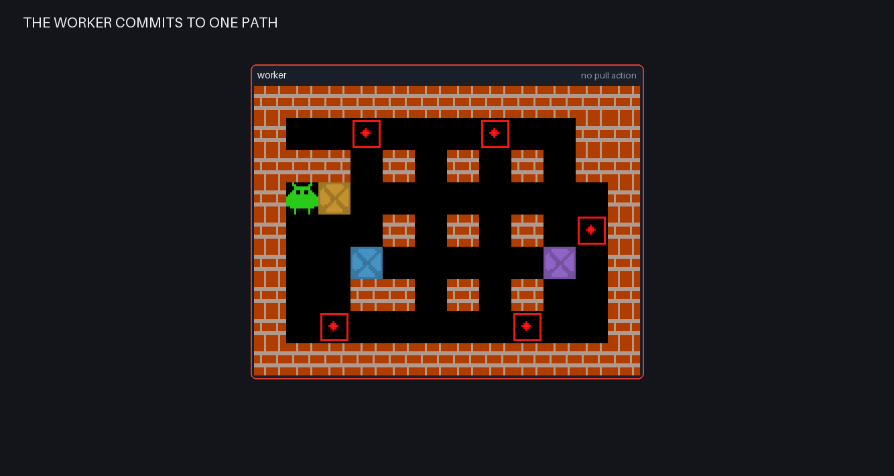
</p>


[Shepherd: Enabling Programmable Meta-Agents via Reversible Agentic Execution
Traces](https://arxiv.org/abs/2605.10913) (Yu et al., 2026) argues that an agent's
execution should be a reversible object rather than a one-way transcript. Record
the run as a Git-like trace, and you can program a second model against it — a
*meta-agent* that inspects any earlier point, reverts to it, then plans and steers
parallel alternative routes.

`rlmflow` already keeps a run as a durable graph of typed nodes, so Shepherd's four
operations — observe, rewind, fork, re-instruct — are graph edits, and the
meta-agent's forks are simply its own children.

Only the revert itself works differently. The paper checkpoints the worker's
process and filesystem, so any program comes back byte-identical. `rlmflow`
already tracks every action as a node, so the cheap route is to fork the graph and
replay those actions — no snapshot to take, and exactly as faithful whenever the
environment is deterministic.

#### Irreversible Sokoban

For this example we augment our RLMs with tools to play Sokoban, where boxes can be pushed but never
pulled. This means a single wrong shove can make the puzzle unsolvable.

For simplicity, we introduce two main tools in the worker's REPL:

```python
def goto(row, col=None):  # walk anywhere reachable; never disturbs a box
    print(game.goto(row, col))

def push(direction):      # shove what you stand against, once per turn
    print(game.push(direction))
```

So a turn can walk to a square, push a direction, or both:

```repl
goto(4, 3)
push("up")
```

```text
walked (3, 2)->(4, 3) in 2 cells
pushed B1 up: (3, 3)->(2, 3)
```

#### Live board context without coupling nodes to Flow

The worker needs the current board in every model request, but that state lives
in its REPL rather than in the durable node graph. The example therefore uses a
current-frontier `render_fn`. `Flow` passes its runtime to the renderer:

```python
def render_worker(runtime: Runtime, node: Node) -> list[dict[str, str]]:
    messages = default_render(runtime, node)
    content = board_prompt(runtime, node.parent_agent, simple=simple_moves)
    if content:
        messages.append({"role": "user", "content": content})
    return messages


flow = Flow(
    client,
    prompt_profiles={
        "worker": PromptProfile(render_fn=render_worker),
    },
)
```

`Node.render()` remains canonical and runtime-independent, while this renderer
can read the live REPL `ENV` for the node currently being sent. The runtime
argument makes that transient dependency explicit without coupling the node
graph to `Flow`. `board_prompt` also stamps the upcoming turn in `ENV` so the
game's one-push guard applies to the next live action; replay does not need that
live-turn guard.

This run starts jammed on purpose: the worker shoves `B1` right eight times until
it sits flat against the wall, where nothing can stand behind it.

<p align="center">
  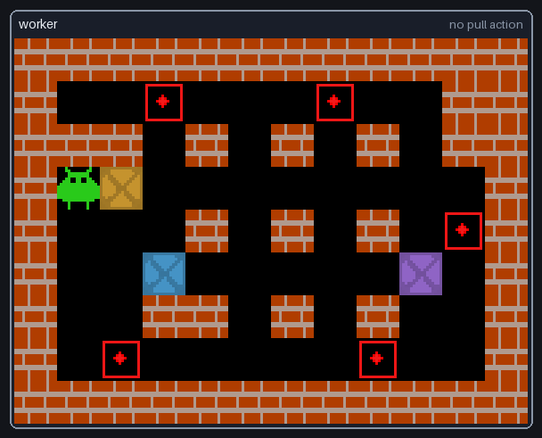
</p>

The meta agent can now come up with distinct new pathways to explore and pick any of those eight spots to revert to, leading to some pretty diverse trajectories. This is done by giving the shepherd agent access to the following tools:

```python
@tool("Inspect the worker after rewinding pushes, without playing.", proxy=True)
async def preview(rewind: int) -> dict:
    """Board, boxes, goals and legal pushes as of `rewind` pushes ago."""

@tool("Record {rewind, order} recovery plans, then stop.", proxy=True)
def branch(specs: list[Plan]) -> str:
    """Each plan is one revert depth plus the box-to-goal order for that worker."""
```

`preview(k)` forks the graph, replays it to `k` pushes ago and returns that state;
the failed run is untouched, so the shepherd can look at every earlier board for
free. `branch(plans)` takes one `{rewind, order}` per attempt and ends the
shepherd's turn: each plan becomes a worker of its own, rewound to that depth and
carrying that order.

#### Step 1 — observe: `preview(k)`

The shepherd's first turn swept every depth — its own code, trimmed:

```repl
for k in range(1, max_k + 1):
    state = await preview(k)
    print(f"===== Preview k={k} =====")
    print(state["board"], state["boxes"], state["legal_pushes"][:10])
```

```text
===== Preview k=3 =====
            11
  012345678901
0 ############
1 #  .   .  ##
2 ### # # # ##
3 #     @$   #
4 #   # # # .#
5 #  $     $ #
6 #  ## # #  #
7 # .     .  #
8 ############
boxes (3): {'B1': (3, 7), 'B2': (5, 3), 'B3': (5, 9)}
legal_pushes (10): ['B1 up from (4,7)', 'B1 down from (2,7)', 'B1 left from (3,8)', ...]
```

#### Step 2 — re-instruct: `branch(plans)`

Its second turn wrote one plan per depth. This is the whole call, untrimmed:

```repl
plans = [
    {"rewind": 6, "order": ["B1->G2 entering from (2,7)", "B2->G1 entering from (2,3)"]},
    {"rewind": 5, "order": ["B1->G2 entering from (1,8)", "B3->G3 entering from (5,10)"]},
    {"rewind": 8, "order": ["B2->G4 entering from (6,2)", "B3->G5 entering from (7,9)"]},
    {"rewind": 4, "order": ["B2->G1 entering from (2,3)", "B3->G5 entering from (7,9)"]},
    {"rewind": 7, "order": ["B1->G1 entering from (2,3)", "B3->G3 entering from (5,10)"]},
    {"rewind": 3, "order": ["B1->G2 entering from (2,7)", "B2->G4 entering from (7,3)"]},
    {"rewind": 2, "order": ["B1->G1 entering from (2,3)", "B2->G4 entering from (6,2)"]},
    {"rewind": 1, "order": ["B3->G3 entering from (5,10)", "B2->G4 entering from (7,3)"]},
]
branch(plans)
```

```text
['stuck', 'stuck', 'solved', 'solved', 'solved', 'solved', 'stuck', 'stuck']
```

A plan is two decisions: where to revert back to, and what strategy to hand the worker
instead. It contains no moves — those stay the worker's job.

#### Step 3 — rewind and fork

The host takes each plan's revert depth and turns it into a graph edit:

```python
cut = push_turns(worker)[-depth].prev
fork = cut.fork()
await flow.replay(fork)
```

`fork()` copies the graph and drops everything after the point it reverted to;
`replay` re-runs the retained actions into a new REPL.

#### Step 4 — resume: each fork is a sub-agent

The forks launch as children of the shepherd, so the search is itself one
recursive agent tree. Each child wakes in a rewound REPL with its instruction
appended:

```text
Rewound 7 pushes. This is a fresh recovery attempt, so abandon the plan you
were following.
...
Lock the boxes in this order: B1->G1 entering from (2,3), then B3->G3 entering
from (5,10). The routes are yours to work out.
```

From there the subagents make their moves, all eight at once:

<table align="center">
  <tr>
    <td align="center">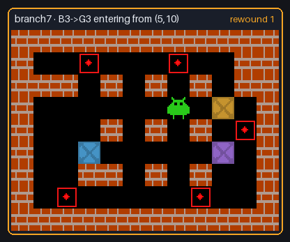<br /><sub>reverted 1 · stuck</sub></td>
    <td align="center">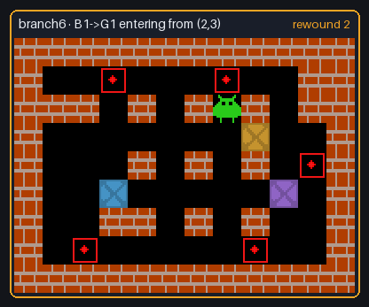<br /><sub>reverted 2 · stuck</sub></td>
    <td align="center">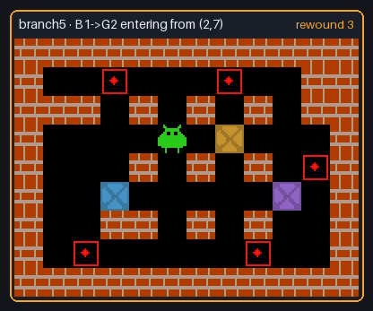<br /><sub>reverted 3 · solved, 16 pushes</sub></td>
    <td align="center">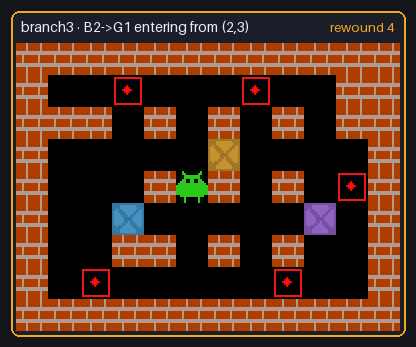<br /><sub>reverted 4 · solved, 18 pushes</sub></td>
  </tr>
  <tr>
    <td align="center">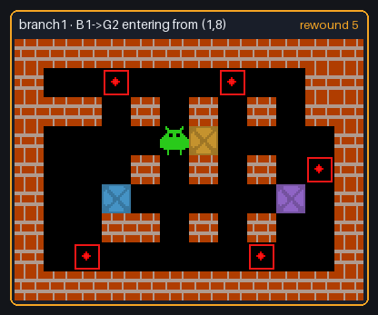<br /><sub>reverted 5 · stuck</sub></td>
    <td align="center">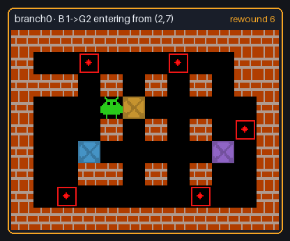<br /><sub>reverted 6 · stuck</sub></td>
    <td align="center">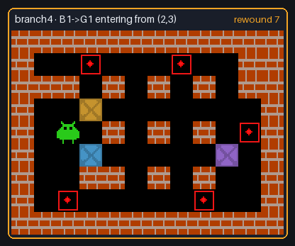<br /><sub>reverted 7 · <b>solved, 8 pushes</b></sub></td>
    <td align="center">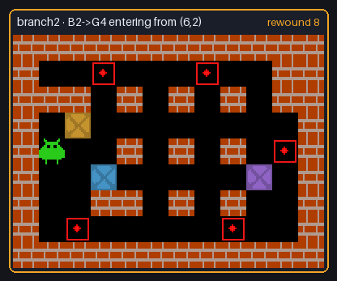<br /><sub>reverted 8 · solved, 9 pushes</sub></td>
  </tr>
</table>

#### Overall Results

Four of the eight branches solved the board, each from a different depth and a
different box-to-goal order.


<p align="center">
  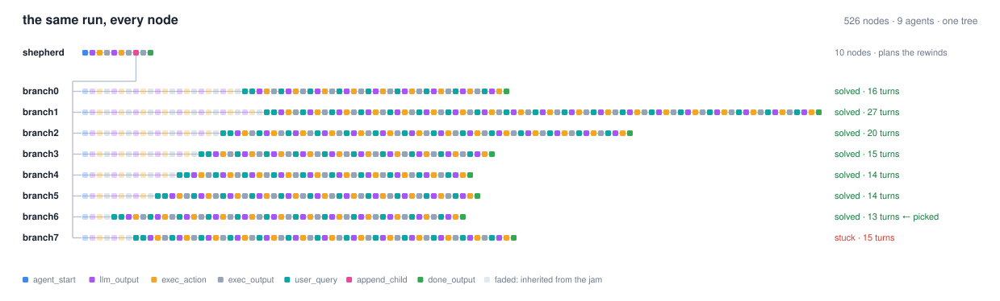
</p>

#### Run it

```bash
python examples/shepherd/shepherd.py                  # --gradio for the live board
python examples/shepherd/shepherd.py --simple-moves   # move([...]) instead of goto + push
python examples/shepherd/render_graph.py              # redraw the diagrams above
```