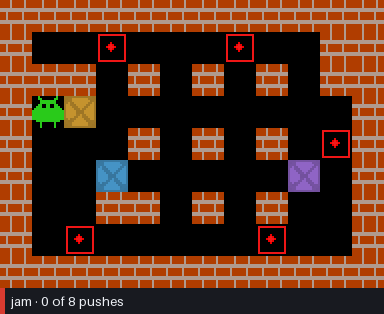
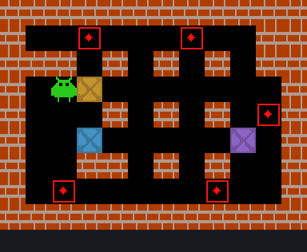
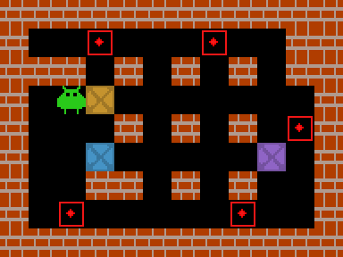
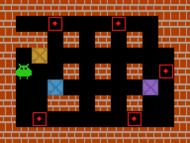
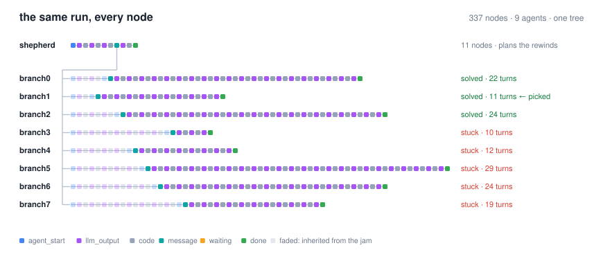

# Recursive Shepherd: RLMs as meta-agents

<p align="center">
  
</p>

[Shepherd: Enabling Programmable Meta-Agents via Reversible Agentic Execution Traces](https://arxiv.org/abs/2605.10913) (Yu et al., 2026) argues that an agent's execution should be a reversible object rather than a one-way transcript. Record the run as a Git-like trace, and you can program a second model against it — a *meta-agent* that inspects any earlier point, reverts to it, then plans and steers parallel alternative routes.

`rlmflow` already keeps a run as a durable graph of nodes, so Shepherd's four operations — observe, rewind, fork, re-instruct — are graph operations: a fork is a copy of the run cut at an earlier node, and re-instructing it is a message injected into the copy.

Only the revert itself works differently. The paper checkpoints the worker's process and filesystem, so any program comes back byte-identical. `rlmflow` already tracks every action as a node, so the cheap route is to fork the graph and replay those actions — no snapshot to take, and exactly as faithful whenever the environment is deterministic.

This example is a live model recovery run. The initial eight-push jam is scripted so every attempt starts from the same failed trace. GPT-5 plans the recovery branches, GPT-5-mini plays them, the host selects the highest score, and the local deterministic Sokoban environment makes retained actions exactly replayable.

#### Irreversible Sokoban

For this example we augment our RLMs with tools to play Sokoban, where boxes can be pushed but never pulled. This means a single wrong shove can make the puzzle unsolvable.

For simplicity, we introduce two main tools in the worker's REPL:

```python
def goto(row, col=None):  # walk anywhere reachable; never disturbs a box
    print(game.goto(row, col))


def push(direction):  # shove what you stand against, once per turn
    print(game.push(direction))
```

So a turn can walk to a square, push a direction, or both:

```repl
goto(4, 3)
push("up")
```

```text
walked (3, 2)->(4, 3) in 2 squares
pushed B1 up: (3, 3)->(2, 3)
```

#### Live board context in each request

The worker's system prompt is only its Sokoban rules: its config uses a `ReplHarness` subclass whose `prompt_sections` are empty, with the rules as the config's `prompt`. The current board changes every turn and lives in the worker's REPL rather than in the graph, so `ShepherdFlow.complete` appends it to the latest user message of each request:

```python
class WorkerHarness(ReplHarness):
    def prompt_sections(self, flow, step):
        return {}


class ShepherdFlow(Flow):
    async def complete(self, messages, model, **kwargs):
        step = current_step()
        if step is not None and messages and messages[0]["role"] == "system":
            board_text = board_prompt(self, step, simple=self.simple_moves)
            ...  # appended to the last user message
        return await super().complete(messages, model, **kwargs)
```

`board_prompt` reads the live REPL `ENV` for the agent being stepped. `board_prompt` also stamps the upcoming turn in `ENV` so the game's one-push guard applies to the next live action; replay does not need that live-turn guard.

This run starts jammed on purpose: the worker shoves `B1` right eight times until it sits flat against the wall, where nothing can stand behind it.

<p align="center">
  
</p>

The meta agent can now come up with distinct new pathways to explore and pick any of those eight spots to revert to, leading to some pretty diverse trajectories. This is done by giving the shepherd agent access to the following tools:

```python
@tool("Inspect the worker after rewinding pushes, without playing.")
async def preview(rewind: int) -> dict:
    """Board, boxes, goals and legal pushes as of `rewind` pushes ago."""


@tool("Record {rewind, order} recovery plans, then stop.")
def branch(specs: list[Plan]) -> str:
    """Each plan is one revert depth plus the box-to-goal order for that worker."""
```

`preview(k)` forks the graph at `k` pushes ago, rebuilds the copy's REPL there and returns that state, then drops the copy; the failed run is untouched, so the shepherd can look at every earlier board for free. `branch(plans)` takes one `{rewind, order}` per attempt and ends the shepherd's turn: each plan becomes a fork of its own, rewound to that depth and carrying that order.

#### Step 1 — observe: `preview(k)`

The shepherd's first turn swept every depth — its own code, trimmed:

```repl
for k in range(1, max_k + 1):
    state = await preview(k)
    print(f"===== Preview k={k} =====")
    print(state["board"], state["boxes"], state["legal_pushes"][:10])
```

```text
===== Preview k=3 =====
            11
  012345678901
0 ############
1 #  .   .  ##
2 ### # # # ##
3 #     @$   #
4 #   # # # .#
5 #  $     $ #
6 #  ## # #  #
7 # .     .  #
8 ############
boxes (3): {'B1': [3, 7], 'B2': [5, 3], 'B3': [5, 9]}
legal_pushes (10): ['B1 up from (4,7)', 'B1 down from (2,7)', 'B1 left from (3,8)', ...]
```

#### Step 2 — re-instruct: `branch(plans)`

After previewing all eight depths and checking candidate goal entrances against the board, the shepherd submitted eight distinct box-to-goal pairings. This is the plan list from the current run:

```repl
plans = [
    {"rewind": 6, "order": ["B2->G4 entering from (6,2)", "B3->G5 entering from (7,9)"]},
    {"rewind": 8, "order": ["B2->G4 entering from (7,3)", "B3->G3 entering from (5,10)"]},
    {"rewind": 7, "order": ["B1->G1 entering from (2,3)", "B3->G5 entering from (7,7)"]},
    {"rewind": 6, "order": ["B1->G2 entering from (2,7)", "B2->G4 entering from (6,2)"]},
    {"rewind": 5, "order": ["B1->G2 entering from (1,6)", "B3->G3 entering from (5,10)"]},
    {"rewind": 4, "order": ["B1->G1 entering from (1,4)", "B2->G5 entering from (7,7)"]},
    {"rewind": 8, "order": ["B3->G2 entering from (1,8)", "B2->G4 entering from (6,2)"]},
    {"rewind": 5, "order": ["B1->G3 entering from (5,10)", "B2->G4 entering from (7,3)"]},
]
branch(plans)
```

After the host forked the run for each plan and ran the forks, their outcomes were:

```text
['stuck', 'solved', 'solved', 'solved', 'solved', 'solved', 'stuck', 'solved']
```

A plan is two decisions: where to revert back to, and what strategy to hand the worker instead. It contains no moves — those stay the worker's job.

#### Step 3 — rewind and fork

The host takes each plan's revert depth and forks the run there:

```python
cut, depth = rewind_point(g, worker, plan["rewind"])  # the turn before that push
branch = g.fork(cut)  # a new graph: the run cut right after cut
copy = branch.agent(worker.id)
await branch_flow.replay(branch, copy)
```

`cut` is the worker's turn just before the push `depth` pushes back. `g.fork(cut)` returns a new graph, a copy of the run with the same ids, holding the worker with its nodes ending at `cut`. The shepherd runs on a graph of its own and only reads and forks the worker's run, so no branch carries a copy of it. The original run is untouched. `replay` runs the copy's nodes again in a REPL of its own, so its board is the one the worker had at that point.

#### Step 4 — resume: inject the order and run each fork

Each fork gets its instruction as a message, then runs on its own Flow, all eight at once:

```python
branch.send(
    copy, f"Rewound {depth} pushes. ... Lock the boxes in this order: {order}.", sender="shepherd"
)
await asyncio.gather(*(play(branch) for branch in branches))
```

Each copy wakes in a rewound REPL with its instruction appended:

```text
Rewound 7 pushes. This is a fresh recovery attempt, so abandon the plan you
were following.
...
Lock the boxes in this order: B1->G1 entering from (2,3), then B3->G5 entering
from (7,7). The routes are yours to work out.
```

From there the forks make their moves:

<table class="branch-grid" style="width:100%;table-layout:fixed;border-collapse:separate;border-spacing:12px 16px">
  <colgroup>
    <col style="width:25%" />
    <col style="width:25%" />
    <col style="width:25%" />
    <col style="width:25%" />
  </colgroup>
  <tr>
    <td style="width:25%;vertical-align:top;text-align:center"><br /><sub>branch0 · reverted 6 · stuck, 14 pushes</sub></td>
    <td style="width:25%;vertical-align:top;text-align:center"><br /><sub>branch1 · reverted 8 · solved, 14 pushes</sub></td>
    <td style="width:25%;vertical-align:top;text-align:center"><br /><sub>branch2 · reverted 7 · <b>selected, solved in 11 pushes</b></sub></td>
    <td style="width:25%;vertical-align:top;text-align:center"><br /><sub>branch3 · reverted 6 · solved, 12 pushes</sub></td>
  </tr>
  <tr>
    <td style="width:25%;vertical-align:top;text-align:center"><br /><sub>branch4 · reverted 5 · solved, 12 pushes</sub></td>
    <td style="width:25%;vertical-align:top;text-align:center"><br /><sub>branch5 · reverted 4 · solved, 34 pushes</sub></td>
    <td style="width:25%;vertical-align:top;text-align:center"><br /><sub>branch6 · reverted 8 · stuck, 8 pushes</sub></td>
    <td style="width:25%;vertical-align:top;text-align:center"><br /><sub>branch7 · reverted 5 · solved, 23 pushes</sub></td>
  </tr>
</table>

#### Forking a Claude Code worker

The workers here run on the REPL harness, where every turn is a node and a fork's REPL is rebuilt by running the agent's nodes again. A Claude Code worker forks the same way, with one difference: the conversation lives in Claude's session, not in the graph.

- Forked at the end of a session turn, the copy resumes that session as a new branch (`--fork-session`), so Claude remembers everything up to that point and the original session is left alone.
- Forked in the middle of a turn, it can't resume. It starts a fresh session, briefed on the code run so far and on the variables in its rebuilt REPL, and starts by reading the `notes` string the worker kept there.

Searchers a worker launched before the fork point are copied with it, and launches in the replayed nodes return those copies instead of running again. Forking at the node that launched them drops them instead, and that node runs again. [`tests/live/fork_halfway.py`](https://github.com/shyamsn97/rlmflow/blob/main/tests/live/fork_halfway.py) checks this on the filesystem needle: it stops a Claude Code root right after the node that launched its searchers and forks it there. The copy reruns that code, which launches its own searchers, then a fresh session finishes the task; the original keeps its searchers.

#### Overall Results

Six of the eight branches solved the board. The shepherd selected `branch2`, which rewound seven pushes and solved in 11 total pushes for a score of 989. That run, saved before forks became copies, held 585 graph nodes in one tree; the selected path is the fresh `rewind.gif` at the top of this page.

<p align="center">
  
</p>

#### Run it

```bash
export OPENAI_API_KEY=...
uv run --locked --python 3.12 --extra openai --extra image \
  python examples/shepherd/shepherd.py \
  --model gpt-5 \
  --fast-model gpt-5-mini \
  --branches 8 \
  --time-budget 1800 \
  --out-dir examples/_runs/shepherd

make showcase-shepherd-assets
```

The run writes the worker's jam under `examples/_runs/shepherd/graph/`, the shepherd's graph under `examples/_runs/shepherd/shepherd/`, each fork under `examples/_runs/shepherd/branches/branchN/`, and JSON/GIF board traces under `examples/_runs/shepherd/traces/`. The make target regenerates `docs/static/shepherd_graph.svg`, `docs/static/shepherd_nodes.svg`, `docs/static/shepherd/rewind.gif`, `jam.gif`, and every `branchN.gif` from those traces. See the [example README](https://github.com/shyamsn97/rlmflow/tree/main/examples/shepherd) for the browser and direct-renderer variants.
